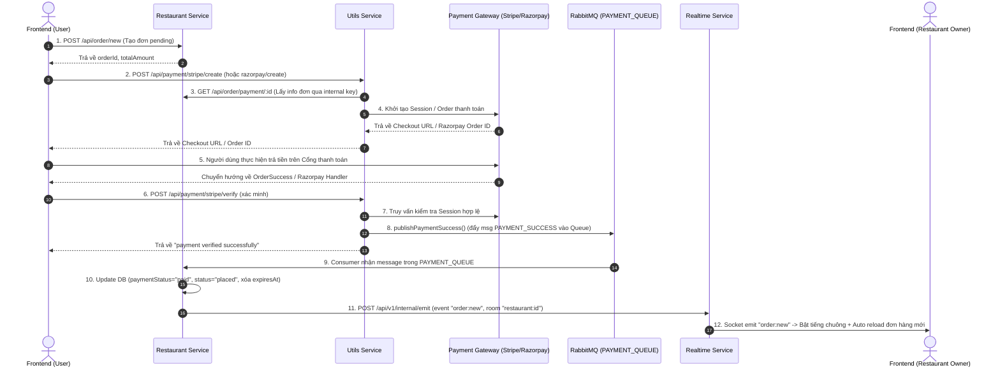
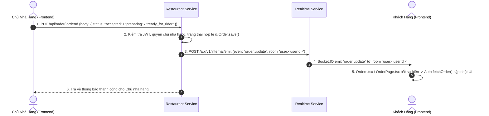

# GIẢI THÍCH CHI TIẾT KIẾN TRÚC & CÁC LUỒNG XỬ LÝ (PAYMENT & UPDATE STATUS)

Tài liệu này giải thích chi tiết hai luồng xử lý chính trong hệ thống Food Delivery Microservices: **Luồng Thanh Toán (Payment Flow)** và **Luồng Cập Nhật Trạng Thái Đơn Hàng (Update Status Flow)**, vị trí và vai trò của **RabbitMQ**, **Socket.IO**, cùng danh sách chức năng của tất cả các file tham gia vào các luồng này.

---

## I. TỔNG QUAN VỀ RABBITMQ VÀ SOCKET.IO TRONG HỆ THỐNG

| Công nghệ | Vị trí xuất hiện | Mục đích & Vai trò | Cơ chế hoạt động |
| :--- | :--- | :--- | :--- |
| **RabbitMQ** | Giữa **Utils Service** (nơi xử lý thanh toán) và **Restaurant Service** (nơi quản lý CSDL Đơn hàng). | **Xử lý sự kiện bất đồng bộ (Event-driven)**, đảm bảo tính tin cậy cao và chống mất dữ liệu khi thanh toán thành công. | **Producer** (`Utils Service`) đẩy message thanh toán vào `PAYMENT_QUEUE` (durable). **Consumer** (`Restaurant Service`) nhận message, cập nhật trạng thái đơn hàng trong MongoDB. |
| **Socket.IO** | Giữa **Realtime Service** và các **Frontend Clients** (Browser của Khách hàng & Chủ Nhà hàng). | **Truyền thông tin Realtime 2 chiều**, tự động cập nhật giao diện mà người dùng không cần bấm F5 / Refresh. | **Server** (`Realtime Service`) chia các socket kết nối thành các **Room** (`user:<userId>`, `restaurant:<restaurantId>`). Khi có sự kiện mới, các Service khác gửi HTTP POST sang `/api/v1/internal/emit` để kích hoạt `io.to(room).emit()`. |

---

## II. CHI TIẾT LUỒNG THANH TOÁN (PAYMENT FLOW)

Luồng Thanh toán xử lý việc tạo đơn hàng tạm thời, tích hợp cổng thanh toán trực tuyến (Stripe / Razorpay), xác minh kết quả và cập nhật trạng thái đơn hàng qua RabbitMQ & Socket.IO.

### Diagram Sơ Đồ Luồng Payment



### Các bước xử lý chi tiết

1. **Tạo đơn hàng tạm tính (Pending Order)**:
   - Trên [Checkout.tsx](file:///d:/A_Self_Proj/learn_delivery_food_microservice/proj_1/frontend/src/pages/Checkout.tsx), người dùng chọn địa chỉ và phương thức thanh toán (`stripe` hoặc `razorpay`).
   - Frontend gửi `POST /api/order/new` đến **Restaurant Service**.
   - [order.ts](file:///d:/A_Self_Proj/learn_delivery_food_microservice/proj_1/services/restaurant/src/controllers/order.ts) (`createOrder`):
     - Kiểm tra giỏ hàng và địa chỉ.
     - Tính khoảng cách, phí giao hàng, phí dịch vụ và tổng tiền.
     - Tạo bản ghi [Order](file:///d:/A_Self_Proj/learn_delivery_food_microservice/proj_1/services/restaurant/src/models/Order.ts) trong MongoDB với `status: "placed"`, `paymentStatus: "pending"`, cài đặt `expiresAt` (15 phút tự xóa nếu không trả tiền).
     - Xóa giỏ hàng ([Cart](file:///d:/A_Self_Proj/learn_delivery_food_microservice/proj_1/services/restaurant/src/models/Cart.ts)).
     - Trả về `orderId` và `amount`.

2. **Khởi tạo thanh toán với Stripe / Razorpay**:
   - **Với Stripe**:
     - Frontend gọi `POST /api/payment/stripe/create` tới **Utils Service**.
     - [payment.ts (Utils)](file:///d:/A_Self_Proj/learn_delivery_food_microservice/proj_1/services/utils/src/controllers/payment.ts) (`payWithStripe`) gọi lại **Restaurant Service** để xác minh số tiền, sau đó gọi Stripe API tạo Checkout Session đính kèm `metadata: { orderId }`.
     - Trả về Stripe Checkout URL để Frontend điều hướng khách hàng tới trang Stripe.
   - **Với Razorpay**:
     - Frontend gọi `POST /api/payment/create` tới **Utils Service**.
     - [payment.ts (Utils)](file:///d:/A_Self_Proj/learn_delivery_food_microservice/proj_1/services/utils/src/controllers/payment.ts) (`createRzaorpayOrder`) khởi tạo đơn hàng trên Razorpay và trả về `razorpayOrderId` để mở Pop-up thanh toán SDK.

3. **Xác thực kết quả thanh toán (Verification)**:
   - **Stripe**: Khi thanh toán thành công, Stripe chuyển hướng về [OrderSuccess.tsx](file:///d:/A_Self_Proj/learn_delivery_food_microservice/proj_1/frontend/src/pages/OrderSuccess.tsx) với `session_id`. Component gửi `POST /api/payment/stripe/verify` tới **Utils Service**.
   - [payment.ts (Utils)](file:///d:/A_Self_Proj/learn_delivery_food_microservice/proj_1/services/utils/src/controllers/payment.ts) (`verifyStripe`) kiểm tra phiên thanh toán hợp lệ với Stripe và lấy lại `orderId`.

4. **Phát Message lên RabbitMQ**:
   - Sau khi xác thực hợp lệ, **Utils Service** gọi `publishPaymentSuccess()` trong [payment.product.ts](file:///d:/A_Self_Proj/learn_delivery_food_microservice/proj_1/services/utils/src/config/payment.product.ts).
   - Hàm này đưa message `{ type: "PAYMENT_SUCCESS", data: { orderId, paymentId, provider } }` vào **RabbitMQ Queue** (`PAYMENT_QUEUE`) ở chế độ `persistent: true`.

5. **Xử lý Message tại Restaurant Service**:
   - [payment.consumer.ts](file:///d:/A_Self_Proj/learn_delivery_food_microservice/proj_1/services/restaurant/src/config/payment.consumer.ts) (`startPaymentConsumer`) đang chạy ngầm lắng nghe `PAYMENT_QUEUE`.
   - Nhận message -> Cập nhật MongoDB:
     - `paymentStatus = "paid"`
     - `status = "placed"`
     - Hủy trường `expiresAt` (ngăn MongoDB TTL tự động xóa đơn hàng).
   - Gửi xác nhận `channel.ack(msg)` cho RabbitMQ.

6. **Phát thông báo Realtime cho Nhà hàng**:
   - Ngay sau khi update DB, `payment.consumer.ts` gửi HTTP POST tới **Realtime Service**:
     - Endpoint: `POST /api/v1/internal/emit`
     - Payload: `event: "order:new"`, `room: "restaurant:${restaurantId}"`.
   - [socket.ts](file:///d:/A_Self_Proj/learn_delivery_food_microservice/proj_1/services/realtime/src/socket.ts) phát sự kiện Socket.IO `order:new` đến room nhà hàng.
   - Component [RestaurantOrders.tsx](file:///d:/A_Self_Proj/learn_delivery_food_microservice/proj_1/frontend/src/components/RestaurantOrders.tsx) nhận sự kiện -> Phát chuông báo động + Tự động tải lại danh sách đơn mới.

---

## III. CHI TIẾT LUỒNG CẬP NHẬT TRẠNG THÁI ĐƠN HÀNG (UPDATE STATUS FLOW)

Luồng này dùng khi Chủ nhà hàng thay đổi tiến độ xử lý của đơn hàng (ví dụ: Chấp nhận đơn -> Đang chuẩn bị -> Sẵn sàng giao).

### Diagram Sơ Đồ Luồng Update Status



### Các bước xử lý chi tiết

1. **Thao tác chuyển trạng thái trên Frontend Nhà hàng**:
   - Tại màn hình Dashboard [RestaurantOrders.tsx](file:///d:/A_Self_Proj/learn_delivery_food_microservice/proj_1/frontend/src/components/RestaurantOrders.tsx) -> [OrderCard.tsx](file:///d:/A_Self_Proj/learn_delivery_food_microservice/proj_1/frontend/src/components/OrderCard.tsx), dựa theo sơ đồ quy trình [orderflow.ts](file:///d:/A_Self_Proj/learn_delivery_food_microservice/proj_1/frontend/src/utils/orderflow.ts), các nút chuyển trạng thái hiển thị theo thứ tự:
     - `placed` -> Bấm nút `mark as accepted`
     - `accepted` -> Bấm nút `mark as preparing`
     - `preparing` -> Bấm nút `mark as ready_for_rider`
   - [OrderCard.tsx](file:///d:/A_Self_Proj/learn_delivery_food_microservice/proj_1/frontend/src/components/OrderCard.tsx) gửi request `PUT /api/order/:orderId` kèm trạng thái mới.

2. **Xử lý tại Restaurant Service**:
   - [order.ts](file:///d:/A_Self_Proj/learn_delivery_food_microservice/proj_1/services/restaurant/src/controllers/order.ts) (`updateOrderStatus`):
     - Xác thực Token của người dùng.
     - Kiểm tra trạng thái mới có nằm trong `ALLOWED_STATUS` (`accepted`, `preparing`, `ready_for_rider`).
     - Tìm bản ghi đơn hàng, kiểm tra `paymentStatus === "paid"`.
     - Xác minh người dùng hiện tại chính là chủ sở hữu nhà hàng (`restaurant.ownerId === user._id`).
     - Gán `order.status = status` và thực hiện `await order.save()`.

3. **Gửi tín hiệu Realtime qua HTTP Internal**:
   - **Restaurant Service** gửi HTTP POST request sang **Realtime Service**:
     - Endpoint: `POST ${REALTIME_SERVICE}/api/v1/internal/emit`
     - Headers: `x-internal-key: INTERNAL_SERVICE_KEY`
     - Body:
       - `event: "order:update"`
       - `room: "user:${order.userId}"`
       - `payload: { orderId: order._id, status: order.status }`

4. **Realtime Service phát sự kiện Socket.IO**:
   - Route [internal.ts](file:///d:/A_Self_Proj/learn_delivery_food_microservice/proj_1/services/realtime/src/routes/internal.ts) nhận request, kiểm tra khóa bảo mật nội bộ.
   - Lấy instance Socket.IO từ [socket.ts](file:///d:/A_Self_Proj/learn_delivery_food_microservice/proj_1/services/realtime/src/socket.ts) và thực hiện `io.to("user:${userId}").emit("order:update", payload)`.

5. **Client Khách hàng nhận sự kiện & Render lại màn hình**:
   - Khách hàng đã đăng nhập có kết nối Socket.IO duy trì thông qua [SocketContext.tsx](file:///d:/A_Self_Proj/learn_delivery_food_microservice/proj_1/frontend/src/context/SocketContext.tsx) và được tự động phân vào room `user:${userId}`.
   - Các màn hình [Orders.tsx](file:///d:/A_Self_Proj/learn_delivery_food_microservice/proj_1/frontend/src/pages/Orders.tsx) (Danh sách đơn của tôi) và [OrderPage.tsx](file:///d:/A_Self_Proj/learn_delivery_food_microservice/proj_1/frontend/src/pages/OrderPage.tsx) (Chi tiết đơn hàng) đăng ký lắng nghe:
     ```ts
     socket.on("order:update", onOrderUpdate);
     ```
   - Ngay khi nhận sự kiện `order:update`, callback `onOrderUpdate` lập tức gọi lại hàm `fetchOrders()` / `fetchOrder()`, dữ liệu mới nhất được nạp về và hiển thị trên màn hình người dùng theo thời gian thực mà không cần ấn tải lại trang.

---

## IV. DANH SÁCH & VAI TRÒ CỦA TẤT CẢ CÁC FILE THAM GIA

### 1. Nhóm Frontend (`proj_1/frontend/src/`)

| Đường dẫn File | Vai trò & Chức năng chi tiết |
| :--- | :--- |
| [SocketContext.tsx](file:///d:/A_Self_Proj/learn_delivery_food_microservice/proj_1/frontend/src/context/SocketContext.tsx) | Quản lý kết nối Socket.IO client toàn cục. Tự động gửi JWT Token khi handshake, kết nối khi `isAuth = true` và dọn dẹp kết nối khi đăng xuất/unmount. |
| [AppContext.tsx](file:///d:/A_Self_Proj/learn_delivery_food_microservice/proj_1/frontend/src/context/AppContext.tsx) | Quản lý state chung toàn ứng dụng (thông tin người dùng `user`, trạng thái `isAuth`, dữ liệu giỏ hàng `cart`, vị trí GPS `location`). |
| [Checkout.tsx](file:///d:/A_Self_Proj/learn_delivery_food_microservice/proj_1/frontend/src/pages/Checkout.tsx) | Giao diện thanh toán. Gọi API tạo order (`POST /api/order/new`), sau đó gọi Utils Service khởi tạo phiên thanh toán Stripe (`payWithStripe`) hoặc Razorpay (`payWithRazorpay`). |
| [OrderSuccess.tsx](file:///d:/A_Self_Proj/learn_delivery_food_microservice/proj_1/frontend/src/pages/OrderSuccess.tsx) | Trang đích điều hướng khi Stripe thanh toán thành công. Lấy `session_id` từ URL và gọi API xác nhận `POST /api/payment/stripe/verify`. |
| [Orders.tsx](file:///d:/A_Self_Proj/learn_delivery_food_microservice/proj_1/frontend/src/pages/Orders.tsx) | Màn hình danh sách đơn hàng cá nhân của Khách hàng. Lắng nghe socket event `order:update` để tự động cập nhật danh sách đơn hàng active/completed. |
| [OrderPage.tsx](file:///d:/A_Self_Proj/learn_delivery_food_microservice/proj_1/frontend/src/pages/OrderPage.tsx) | Màn hình chi tiết một đơn hàng. Lắng nghe socket event `order:update` để cập nhật trạng thái đơn (Status Badge) realtime. |
| [RestaurantOrders.tsx](file:///d:/A_Self_Proj/learn_delivery_food_microservice/proj_1/frontend/src/components/RestaurantOrders.tsx) | Dashboard quản lý đơn cho Chủ nhà hàng. Lắng nghe socket event `order:new`, phát âm thanh báo động (Web Audio API) và tự tải đơn hàng mới về. |
| [OrderCard.tsx](file:///d:/A_Self_Proj/learn_delivery_food_microservice/proj_1/frontend/src/components/OrderCard.tsx) | Component hiển thị thẻ đơn hàng trên Dashboard nhà hàng. Chứa nút chuyển trạng thái (`accepted`, `preparing`, `ready_for_rider`) gửi request PUT đến backend. |
| [orderflow.ts](file:///d:/A_Self_Proj/learn_delivery_food_microservice/proj_1/frontend/src/utils/orderflow.ts) | Định nghĩa luồng hành động trạng thái hợp lệ (`placed` -> `accepted` -> `preparing` -> `ready_for_rider`). |

---

### 2. Nhóm Service Utils (`proj_1/services/utils/src/`)

| Đường dẫn File | Vai trò & Chức năng chi tiết |
| :--- | :--- |
| [rabbitmq.ts](file:///d:/A_Self_Proj/learn_delivery_food_microservice/proj_1/services/utils/src/config/rabbitmq.ts) | Kết nối đến RabbitMQ Broker, tạo channel giao tiếp và đảm bảo queue `PAYMENT_QUEUE` tồn tại (`durable: true`). Cung cấp hàm `getChanel()`. |
| [payment.product.ts](file:///d:/A_Self_Proj/learn_delivery_food_microservice/proj_1/services/utils/src/config/payment.product.ts) | Định nghĩa hàm `publishPaymentSuccess()`. Chuyển payload thông tin thanh toán thành Buffer và đẩy vào `PAYMENT_QUEUE` với thuộc tính `persistent: true`. |
| [verifyRazorpay.ts](file:///d:/A_Self_Proj/learn_delivery_food_microservice/proj_1/services/utils/src/config/verifyRazorpay.ts) | Cung cấp hàm `verifyRazorpaySignature()` sử dụng thuật toán HMAC SHA256 kiểm tra tính toàn vẹn của chữ ký bảo mật từ Razorpay trả về. |
| [payment.ts](file:///d:/A_Self_Proj/learn_delivery_food_microservice/proj_1/services/utils/src/controllers/payment.ts) | Controller chính của Utils Service: <br/>- `payWithStripe`: Tạo Stripe Checkout Session.<br/>- `verifyStripe`: Kiểm tra phiên thanh toán Stripe và gọi `publishPaymentSuccess()`.<br/>- `createRzaorpayOrder`: Tạo Razorpay Order ID.<br/>- `verifyRazorPayPayment`: Xác minh chữ ký Razorpay và gọi `publishPaymentSuccess()`. |
| [payments.ts](file:///d:/A_Self_Proj/learn_delivery_food_microservice/proj_1/services/utils/src/routes/payments.ts) | Khai báo các route API HTTP cho thanh toán (`/stripe/create`, `/stripe/verify`, `/create`, `/verify`). |

---

### 3. Nhóm Service Restaurant (`proj_1/services/restaurant/src/`)

| Đường dẫn File | Vai trò & Chức năng chi tiết |
| :--- | :--- |
| [Order.ts](file:///d:/A_Self_Proj/learn_delivery_food_microservice/proj_1/services/restaurant/src/models/Order.ts) | Mongoose Model cho Đơn hàng (`Order`). Lưu trữ các trường `userId`, `restaurantId`, `items`, `totalAmount`, `status`, `paymentStatus`, và `expiresAt` (TTL Index 15 phút). |
| [rabbitmq.ts](file:///d:/A_Self_Proj/learn_delivery_food_microservice/proj_1/services/restaurant/src/config/rabbitmq.ts) | Thiết lập kết nối RabbitMQ Channel cho Restaurant Service. |
| [payment.consumer.ts](file:///d:/A_Self_Proj/learn_delivery_food_microservice/proj_1/services/restaurant/src/config/payment.consumer.ts) | RabbitMQ Consumer lắng nghe `PAYMENT_QUEUE`. Khi nhận sự kiện `PAYMENT_SUCCESS` -> Cập nhật MongoDB (`paymentStatus = "paid"`, `status = "placed"`, xóa `expiresAt`), gửi HTTP POST thông báo sang Realtime Service (`order:new`), và gửi `ack` xác nhận với RabbitMQ. |
| [order.ts](file:///d:/A_Self_Proj/learn_delivery_food_microservice/proj_1/services/restaurant/src/controllers/order.ts) | Controller quản lý đơn hàng:<br/>- `createOrder`: Tạo bản ghi đơn hàng mới (status `placed`, paymentStatus `pending`).<br/>- `fetchOrderForPayment`: Cho phép Utils Service lấy thông tin số tiền để khởi tạo thanh toán.<br/>- `updateOrderStatus`: Cập nhật trạng thái đơn từ nhà hàng và gửi HTTP POST sang Realtime Service (`order:update`).<br/>- `getMyOrders` & `fetchSingleOrder`: Truy vấn đơn hàng cho Khách hàng. |
| [order.ts (routes)](file:///d:/A_Self_Proj/learn_delivery_food_microservice/proj_1/services/restaurant/src/routes/order.ts) | Khai báo các endpoint HTTP cho đơn hàng (`/new`, `/payment/:id`, `/:orderId`, `/myorder`, `/restaurant/:restaurantId`). |

---

### 4. Nhóm Service Realtime (`proj_1/services/realtime/src/`)

| Đường dẫn File | Vai trò & Chức năng chi tiết |
| :--- | :--- |
| [socket.ts](file:///d:/A_Self_Proj/learn_delivery_food_microservice/proj_1/services/realtime/src/socket.ts) | Khởi tạo máy chủ Socket.IO trên HTTP Server. Giải mã và xác thực JWT Token từ client. Phân bổ kết nối socket vào các Room thích hợp: `user:${userId}` và `restaurant:${restaurantId}`. |
| [internal.ts](file:///d:/A_Self_Proj/learn_delivery_food_microservice/proj_1/services/realtime/src/routes/internal.ts) | Route HTTP nội bộ `POST /api/v1/internal/emit`. Xác thực bằng `x-internal-key`, lấy instance `io` và thực hiện `io.to(room).emit(event, payload)` tới các client đang kết nối. |
| [index.ts](file:///d:/A_Self_Proj/learn_delivery_food_microservice/proj_1/services/realtime/src/index.ts) | Entry point của Realtime Service. Khởi tạo Express App, gắn middleware JSON/CORS, nạp `internalRoute` và liên kết với máy chủ Socket.IO qua `initSocket(server)`. |

---

## V. TÓM TẮT TỔNG THỂ VÀ ĐIỂM SÁNG TRONG KIẾN TRÚC

1. **Phân tách trách nhiệm (Separation of Concerns)**:
   - **Utils Service** tập trung giao tiếp với các bên thứ 3 (Stripe / Razorpay).
   - **Restaurant Service** tập trung làm việc với CSDL chính (MongoDB) và nghiệp vụ nhà hàng.
   - **Realtime Service** chuyên trách quản lý kết nối Socket.IO duy trì trạng thái dài hạn (stateful WebSocket connections) độc lập với các stateless API services khác.

2. **Tính tin cậy dữ liệu với RabbitMQ**:
   - Khi thanh toán thành công, Utils Service không gọi trực tiếp DB của Restaurant Service (tránh thắt nút cổ chai & mất dữ liệu nếu network lỗi), mà chuyển giao nhiệm vụ qua Message Queue (RabbitMQ).

3. **Cập nhật giao diện mượt mà với Socket.IO**:
   - Nhà hàng nhận đơn tức thì với âm thanh báo động ngay khi thanh toán vừa được xác nhận.
   - Khách hàng theo dõi tiến độ món ăn nhảy theo thời gian thực mà không cần ấn F5 hay chờ trang load lại.
